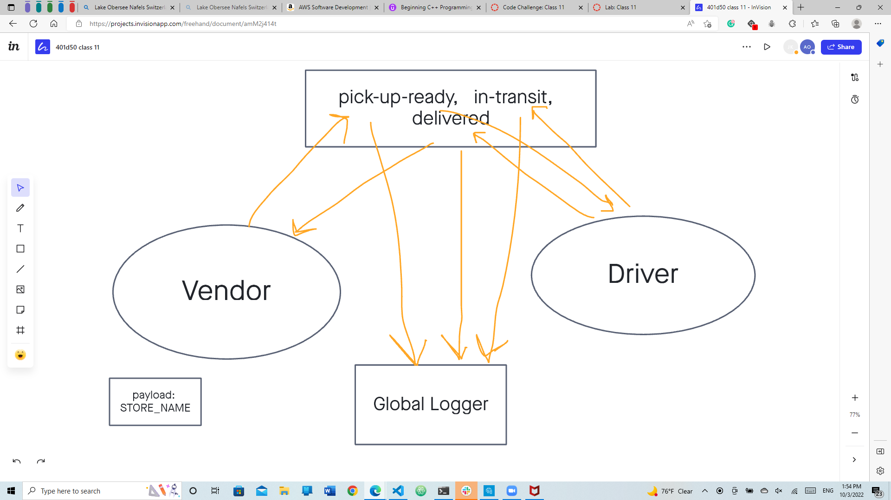

# CAPS

## Problem domain
The following user/developer stories detail the major functionality for this phase of the project.
As a vendor, I want to alert the system when I have a package to be picked up.
As a driver, I want to be notified when there is a package to be delivered.
As a driver, I want to alert the system when I have picked up a package and it is in transit.
As a driver, I want to alert the system when a package has been delivered.
As a vendor, I want to be notified when my package has been delivered.

## Testing
Write a complete set of tests for all functional units and modules
Your tests must be running green on Github Actions
[TESTS](./__tests__)

## Documentation

## Collaborations
David Suy, Jordan Yamada, Jeffrey Smith
